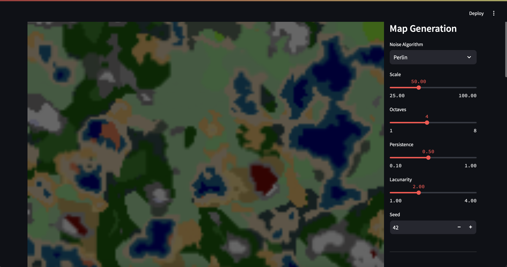
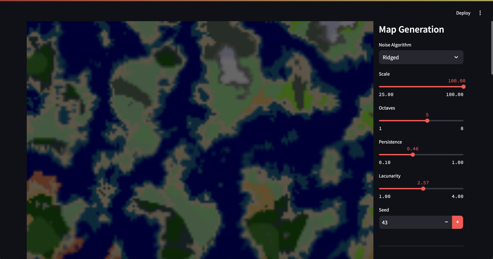
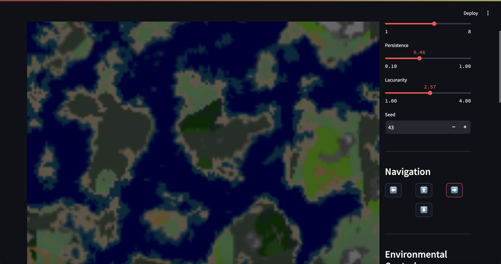
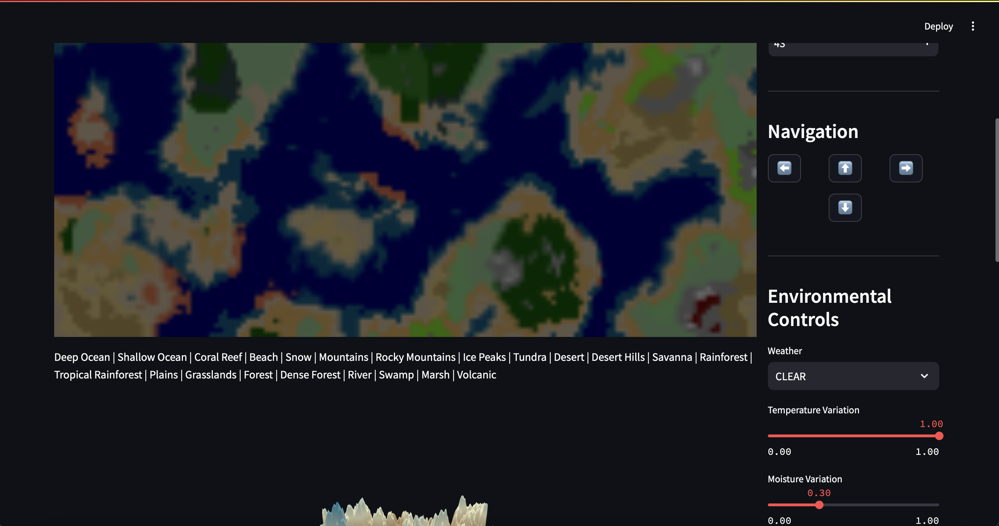
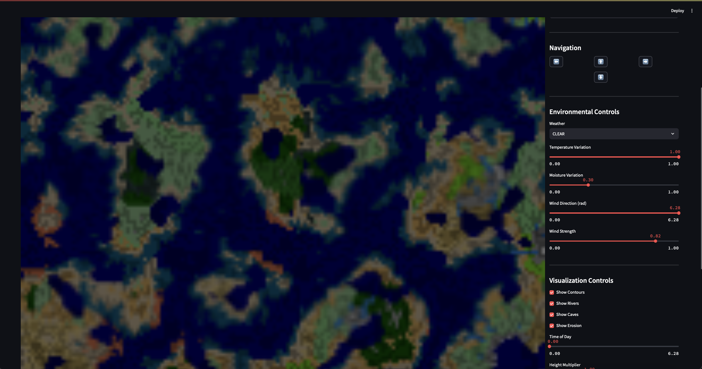
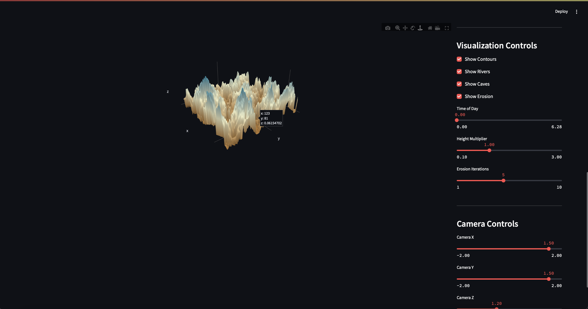

Welcome to Map Generation! Check it out [here](WILL ADD LINK ONCE DEPLOYED).

The application generates a bunch of random biomes and offers a significant amount of control over this generation, including the noise algorithm,

navigation controls that move the minimap around,

environmental controls (weather only controls the luminosity of the map as of right now – I will make it more useful once I get an idea of what I can do with it; however, the rest do cause meaningful changes in the generation of the world),

visualization controls to view things such as rivers, contours, caves, and erosion, 

and camera controls for the 3D generated plot that corresponds to the minimap! (I may add auto-rotate soon...)

